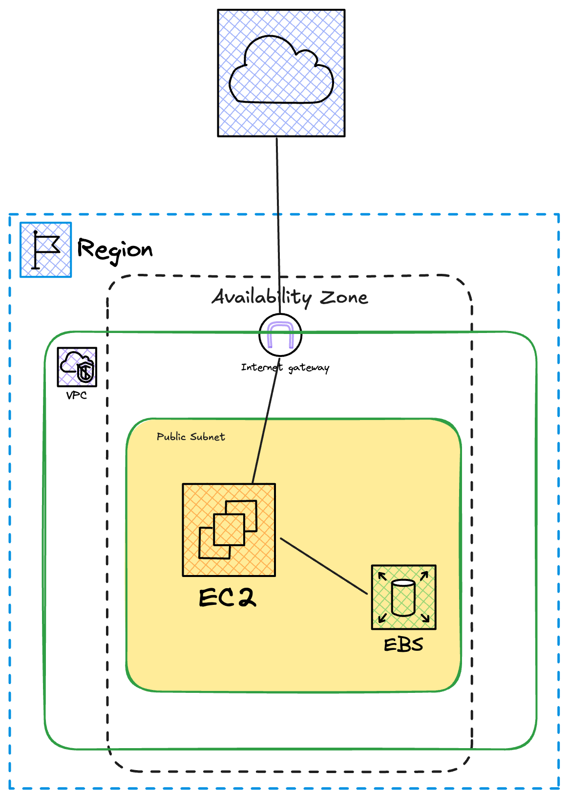

# gpt4all-on-aws
Terraform code to host gpt4all on AWS.

This code will create EC2 instance with attached EBS volume, generate SSH key to access created EC2 instance.
Below set of variables could be configured via the file `terraform.tfvars`

| Variable          | Description                                    | Default Value                     |
|-------------------|------------------------------------------------|-----------------------------------|
| `aws_region`      | AWS Region                                     | `eu-central-1`                    |
| `tag_prefix`      | Prefix, will be used for all created resources | `gpt4all`                         |
| `ami_id`          | AMI id                                         | `ami-0592c673f0b1e7665`           |
| `instance_type`   | AWS Instance Type                              | `t2.xlarge`                       |
| `key_name`        | SSH key connect EC2 instance                   | `auto-generated-ssh-key`          |
| `aws_azs`         | AWS availability zone                          | `eu-central-1a`                   |
| `ebs_size`        | AWS EBS volume size                            | `100`                             |

cd to the directory root folder and run the following commands:

```
terraform init
terraform apply
```

Connect to EC2 instance
```bash
chmod 600 private_key.pem
ssh -i private_key.pem ec2-user@< terraform output result>
```
